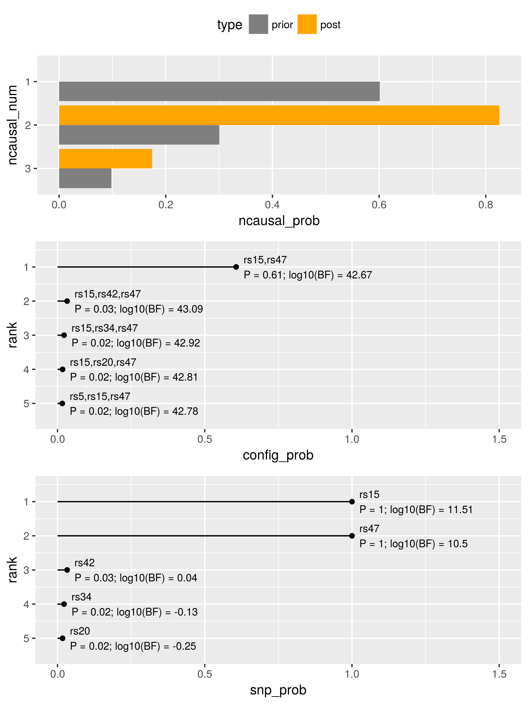

# finemapr

R wrapper to fine-mappers

## FINEMAP example
```r
# specify where the FINEMAP tool is located (user-specific)
# - the user needs to download and install the tool before the analysis
# - here, the tool binary file is stored in `~/apps/finemap/` directory
options(finemapr_finemap = "~/apps/finemap/finemap")

# load example data from FINEMAP (http://www.christianbenner.com/)
# - data are obtained from the same directory `~/apps/finemap/`, subdirectory `example`
ex <- example_finemap()

# run the tool
# - simulated data in region 1 (used here in the analysis) assumed 2 causal SNPs
# - arg. #1: table with SNP name and Z-score in the first 2 columns
# - arg. #2: the LD matrix with colnames/rownames corresponding to SNP names
# - arg. #3: the number of invidivudals
# - arg. `args`: pass other arguments to the tool as a string 
out <- run_finemap(ex$tab1, ex$ld1, ex$n1, args = "--n-causal-max 3")
```


```r
print(out)
```

```
 - command: ~/apps/finemap/finemap --sss --log --n-causal-max 3 --in-files region.master 
 - see log output in `log`
 - tables of results: `config`, `snp`, `ncausal`
 - config:
# A tibble: 8,086 x 4
   rank config         config_prob config_log10bf
  <int> <chr>                <dbl>          <dbl>
1     1 rs15,rs47           0.607            42.7
2     2 rs15,rs42,rs47      0.0326           43.1
3     3 rs15,rs34,rs47      0.0222           42.9
# ... with 8,083 more rows
```


```r
plot(out, label_size = 3, grid_ncol = 1)
```



