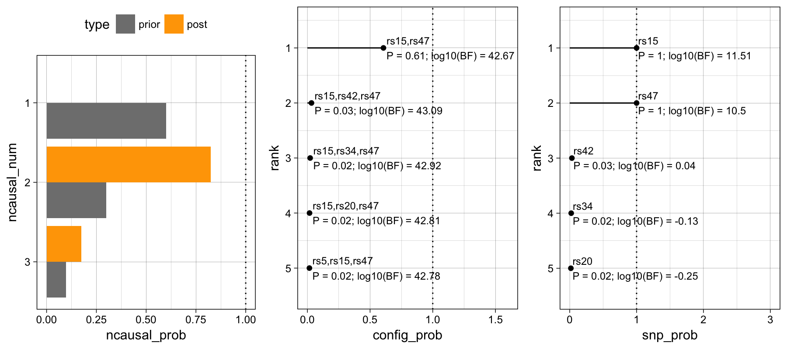

# finemapr



R interface to fine-mappers:

- FINEMAP http://www.christianbenner.com/
- CAVIAR https://github.com/fhormoz/caviar
- PAINTOR https://github.com/gkichaev/PAINTOR_V3.0

By using `finemapr`, your input files are automatically prepared for each tool, the analysis workflow is tool-independent; and exploration of fine-mapping results is powered by R in printing/plotting/data export.

**Note**: the package is still under development and its current version is not stable. The current work aims at switching from `run_<tool>` functions to a more general one, [finemapr](https://github.com/variani/finemapr/blob/master/R/finemapr.R). The later function makes use of S3 method dispatch features. Thus, use this package with caution until the stable release comes out.

## Tool-independent analysis workflow

```r
# set up
options(finemapr_<tool> = "<path to fine-mapping tool>")

# read input files
my_zscores <- read_zscores("<my_scores.tab>")
my_ld <- read_ld("<my_ld.tab>")

# run analysis
# depreciated, but still works: out <- run_<tool>(my_zscores, my_ld, args = "<custom arguments>")
out <- finemapr(my_zscores, my_ld, method = "<tool>", args = "<custom arguments>")

# explore results
print(out)
head(out$snp) # main table of results
plot(out)

# export results
write.table(out$snp, "<my_results.tab>")
```
## Examples

See the vignette [Fine-mapping analysis pipeline by `finemapr`](https://variani.github.io/finemapr/vignettes/finemapr.html).

## Related projects

- [FineMapping pipeline using GWAS summary statistics](https://github.com/jinghuazhao/FM-pipeline)
- [Finemapping pipeline that automates the usage of PAINTOR, and CAVIAR BF](https://github.com/theboocock/fine_mapping_pipeline)

