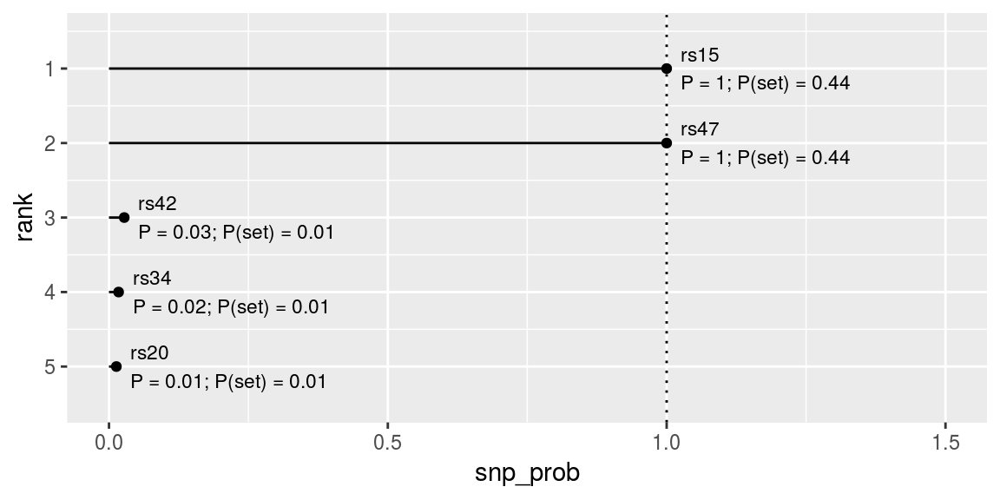

---
output:
  html_document:
    keep_md: true
---


```r
# specify path to CAVIAR (user-specific)
options(finemapr_caviar = "~/apps/caviar/CAVIAR")

# load example data
ex <- example_finemap()

# run the tool
# - arg. #1: table with SNP name and Z-score in the first 2 columns
# - arg. #2: the LD matrix with colnames/rownames corresponding to SNP names
# - arg. `args`: pass other arguments to the tool as a string 
out_caviar <- run_caviar(ex$tab1, ex$ld1, args = "-c 3")
```


```r
print(out_caviar)
```

```
 - command: ~/apps/caviar/CAVIAR -c 3 -z region.z -l region.ld -o log 
 - tables of results: `snp`
 - snp:
# A tibble: 50 x 4
   rank snp   snp_prob_set snp_prob
  <int> <chr>        <dbl>    <dbl>
1     1 rs15        0.439    1.00  
2     2 rs47        0.439    1.00  
3     3 rs42        0.0120   0.0274
# ... with 47 more rows
 - 95%-causal set (ordered): rs15, rs47, rs42, rs34, rs20, rs5, rs27, rs45, rs38, rs17, rs25, rs18, rs11, rs19, rs44, rs40, rs8, rs24 
```


```r
plot(out_caviar, label_size = 3)
```

<!-- -->

